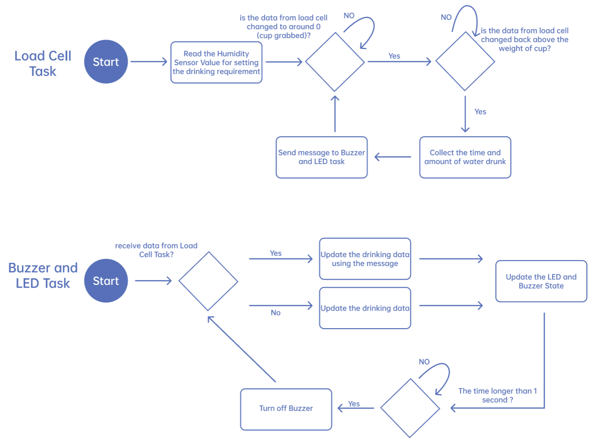
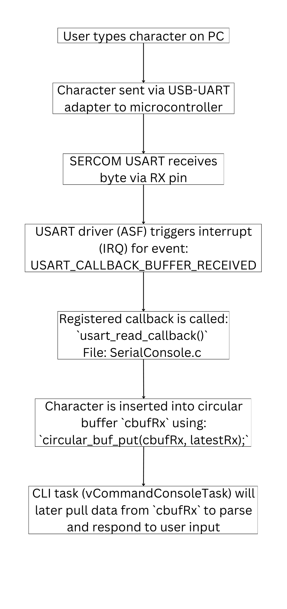
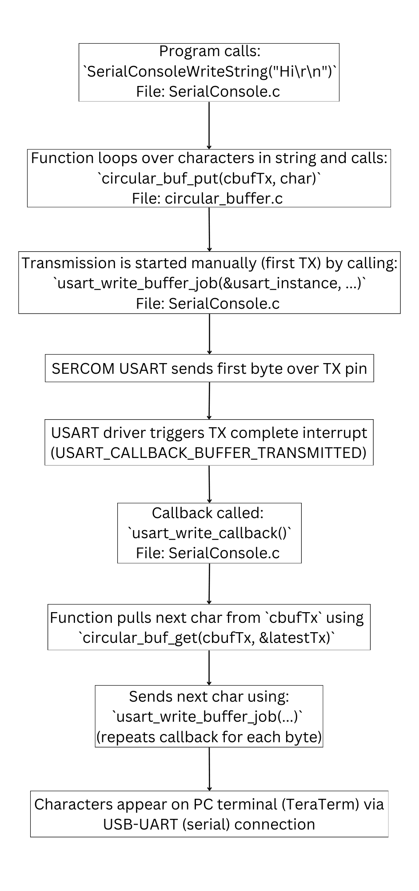
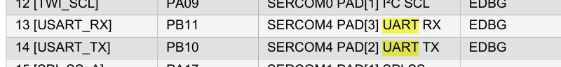
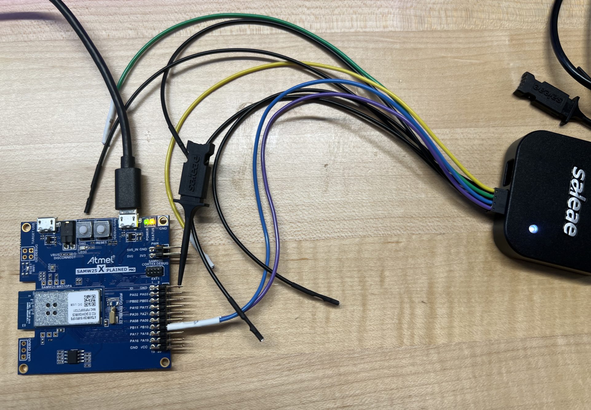
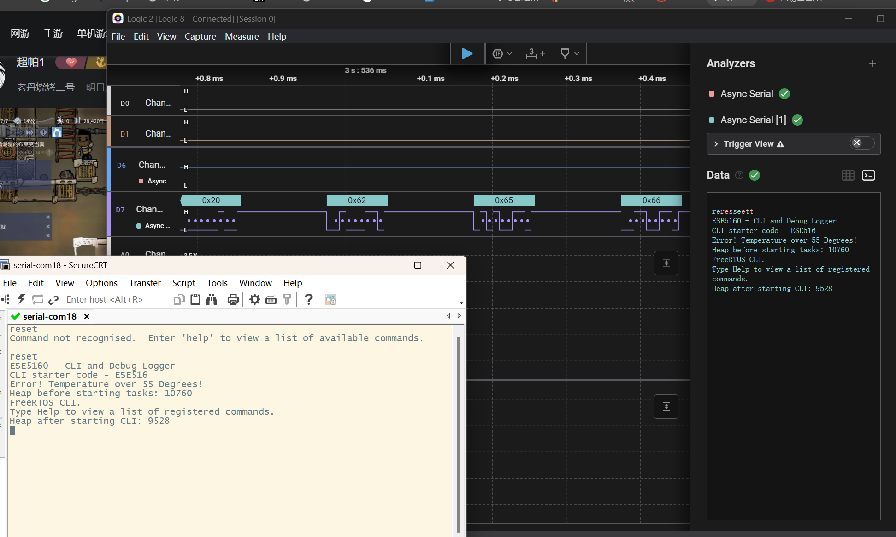

# a07g-exploring-the-CLI

* Team Number:
* Team Name:
* Team Members:
* GitHub Repository URL:
* Description of test hardware: (development boards, sensors, actuators, laptop + OS, etc)

## 1. Software Architecture

### HRS&SRS

Hardware Requirements Specification (HRS)
**HRS 01:** The system shall use the SAMW25 as the main microcontroller for processing and Wi-Fi communication.
**HRS 02:** The device shall include a weight sensor(Load Cell with amplifier) to measure water cup weight changes.
**HRS 03:** The system shall provide real-time reminders using an RGB LED and a buzzer for visual and auditory alerts.
**HRS 04:** The device shall be powered by a single-cell 3.7V Li-Ion battery, with an onboard voltage regulator to provide 3.3V to the microcontroller and peripherals.
**HRS 05:** The hardware shall support Wi-Fi communication for syncing drinking data and receiving app settings.
**HRS 06:** The system shall include a battery management circuit to ensure safe charging and operation of the Li-Ion battery.
**HRS 07:** The system shall include a humidity sensor with I2C interface to measure humidity.

Software Requirements Specification (SRS)
**SRS 01:** The software shall read real-time data from the weight sensor via the I2C interface to track water consumption.
**SRS 02:** The software shall calculate the amount of water consumed after each drinking action and log the timestamp.
**SRS 03:** The system shall send drinking data (time and amount) to the mobile app via Wi-Fi after each drinking action.
**SRS 04:** The software shall receive hydration goal settings from the mobile app and update the device’s behavior accordingly.
**SRS 05:** The system shall trigger LED and buzzer reminders when a hydration interval is missed.
**SRS 06:** The system shall send push notifications via the app when a hydration reminder is triggered.
**SRS 07:** The software shall enter a low-power mode when idle to conserve battery life.
**SRS 08:** The system shall read real-time data from the humidity sensor to adjust the intervals of drinking water.

### Block Diagram

### Flowchart

## 2. Understanding the Starter Code

##### What does “InitializeSerialConsole()” do? In said function, what is “cbufRx” and “cbufTx”? What type of data structure is it?

This function:

* Initializes a UART interface for serial communication.
* Configures the USART hardware and registers callbacks for RX (receive) and TX (transmit).
* Initializes circular buffers cbufRx and cbufTx used for receiving and transmitting characters asynchronously.

“cbufRx” and “cbufTx” are circular buffer handler structures (type: cbuf_handle_t). They are used for buffering incoming (RX) and outgoing (TX) serial characters.
They are of type cbuf_handle_t.

##### How are “cbufRx” and “cbufTx” initialized? Where is the library that defines them (please list the *C file they come from).

They are initialized using this function:
cbufRx = circular_buf_init((uint8_t *)rxCharacterBuffer, RX_BUFFER_SIZE);
cbufTx = circular_buf_init((uint8_t *)txCharacterBuffer, TX_BUFFER_SIZE);
File: CLI Starter Code\src\SerialConsole\SerialConsole.c

##### Where are the character arrays where the RX and TX characters are being stored at the end? Please mention their name and size.

Tip: Please note cBufRx and cBufTx are structures.
The character arrays used to store the RX and TX characters are declared in SerialConsole.c.
char rxCharacterBuffer[RX_BUFFER_SIZE];
Name: rxCharacterBuffer
Size: 512 (defined by #define RX_BUFFER_SIZE 512)
char txCharacterBuffer[TX_BUFFER_SIZE];
Name: txCharacterBuffer
Size: 512 (defined by #define RX_BUFFER_SIZE 512)

##### Where are the interrupts for UART character received and UART character sent defined?

File:
src/SerialConsole/SerialConsole.c
Function: configure_usart_callbacks()
usart_register_callback(&usart_instance, usart_read_callback, USART_CALLBACK_BUFFER_RECEIVED);
usart_enable_callback(&usart_instance, USART_CALLBACK_BUFFER_RECEIVED);

usart_register_callback(&usart_instance, usart_write_callback, USART_CALLBACK_BUFFER_TRANSMITTED);
usart_enable_callback(&usart_instance, USART_CALLBACK_BUFFER_TRANSMITTED);

##### What are the callback functions that are called when: A character is received? (RX) A character has been sent? (TX)

When a character is received (RX): usart_read_callback
When a character has been sent (TX): usart_write_callback

##### Explain what is being done on each of these two callbacks and how they relate to the cbufRx and cbufTx buffers.

RX Callback: usart_read_callback
What is being done:
Read the received character (probably stored in latestRx).
Store it into the circular buffer cbufRx via circular_buf_put().
Trigger a CLI parser.
Relation to cbufRx:
cbufRx holds all characters received from the UART.
Other parts of the code (like CLI task) read characters from this buffer to process commands.

TX Callback: usart_write_callback
What is being done:
Tries to get the next character from the circular buffer cbufTx.
If there’s a character available, it sends it out using:
usart_write_buffer_job(&usart_instance, (uint8_t *)&latestTx, 1);
Relation to cbufTx:
Characters to be sent (e.g. CLI output, debug messages) are added to cbufTx.
The callback drains the buffer one byte at a time, sending each over UART.

##### Draw a diagram that explains the program flow for UART receive – starting with the user typing a character and ending with how that characters ends up in the circular buffer “cbufRx”. Please make reference to specific functions in the starter code.

##### Draw a diagram that explains the program flow for the UART transmission – starting from a string added by the program to the circular buffer “cbufTx” and ending on characters being shown on the screen of a PC (On Teraterm, for example). Please make reference to specific functions in the starter code.

##### What is done on the function “startStasks()” in main.c? How many threads are started?

The StartTasks() function is responsible for:

* Printing current heap size before starting any tasks.
* Creating the CLI thread using FreeRTOS.
* Logging an error if task creation fails.

Only 1 thread is started:

* Name: "CLI_TASK"
* Function: vCommandConsoleTask
* Purpose: Runs the CLI (Command Line Interface) loop that reads user input and responds.

## **3. Debug Logger Module**

See the documents.

## 4. **Wiretap the convo!**

1. What nets must you attach the logic analyzer to? (Check how the firmware sets up the UART in SerialConsole.c!)
   I need to attach the logic analyzer to the UART TX and RX nets and a common ground. From the datasheet, we can see the TX and RX pins are PB10 and PB11.

   
2. Where on the circuit board can you attach / solder to?

   From the datasheet, we can see the TX and RX pins are PB10 and PB11. So i can attach the pins of the analyser to GND on the board, PB10 and PB11 and read the serial.
3. What are critical settings for the logic analyzer?

   First set the analyzers to be Async Serial, then, critical settings include the correct sample rate, proper triggering, and baud rate(115200 in this case) alignment to ensure accurate capture of the UART signals. The color of lines are correspondent to colors of wires.

   

   

   File: see Test1.sal in the repo.

## 5. **Complete the CLI**

See the documents.

## **6. Add CLI commands**

Link of Video: https://youtube.com/shorts/1Dk-mnguCtk
